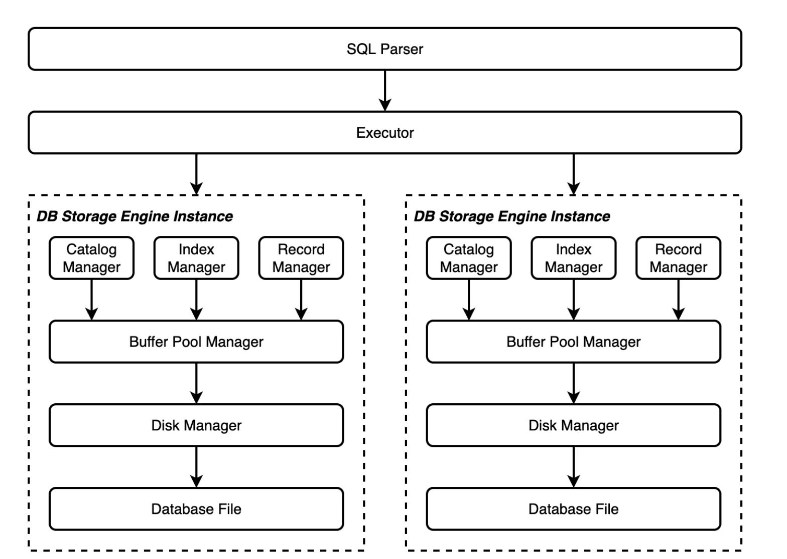

# MiniSQL Database Management System

- ## I. General Overview  

  ### 1.1 Objectives  

  1. Design and implement a simplified single-user SQL engine, **MiniSQL**, allowing users to input SQL statements through a command-line interface to perform basic CRUD (Create, Read, Update, Delete) operations, with performance optimization via indexing.  
  2. Improve system programming skills and deepen the understanding of underlying DBMS (Database Management System) design through the design and implementation of MiniSQL.  

  ### 1.2 Requirements  

  - Support `integer`, `char(n)`, and `float` data types.  
  - Up to 32 attributes per table, with support for `unique` constraints and single-attribute primary keys.  
  - Automatic B+ Tree indexes for primary keys and unique attributes.  
  - Support for equality and range queries, insertions, deletions, and updates.  
  - Use Git or similar tools for code management. Maintain clear commit history and proper coding style.  

  ---

  ## II. System Architecture and Modules  

  ### 2.1 System Architecture Diagram  

  The **SQL Parser** parses SQL statements into a syntax tree, which is executed by the **Executor**.  
  Each **DB Storage Engine Instance** corresponds to a database created with `CREATE DATABASE`.  
  Metadata is managed by the **Catalog Manager**, **Index Manager**, and **Record Manager**.  

 
  2.2 Modules Overview  

  - **Disk Manager**: Manages DB File, page allocation/recycling, read/write operations.  
  - **Buffer Pool Manager**: Caches pages, replacement (LRU), dirty/pin states.  
  - **Record Manager**: Manages record insertion, deletion, search.  
  - **Index Manager**: Handles B+ Tree indexes (create, delete, equality/range query).  
  - **Catalog Manager**: Manages table/index schema metadata.  
  - **Executor**: Generates execution plans from syntax trees and invokes other managers.  
  - **SQL Parser**: Parses SQL, checks correctness, produces syntax trees, executes via Executor.  

  ---

  ## III. Internal Data Structures and Interfaces  

  ### 3.1 Disk & Buffer Pool Manager  

  #### 3.1.1 Buffer Pool Manager  

  - **Design**: Efficiently manages memory pages using free list and LRU replacement. Avoids excessive `new`/`delete`.  
  - **Functions**:  
    - Fetch page: load from disk or reuse memory page.  
    - Release page: decrement pin count; add to replacer if free.  
    - Flush page: write page back to disk.  
    - Create new page: allocate from free list or replacer.  
    - Delete page: flush if dirty, add to free list.  

  #### 3.1.2 LRU Replacer  

  - **Design**: Implements LRU policy using `list` and `vector`.  
  - **Functions**:  
    - Get victim page.  
    - Pin (remove from list).  
    - Unpin (add back to list).  

  #### 3.1.3 Disk Manager  

  - **Design**: Manages DB files, logical/physical page mapping, bitmap page allocation.  
  - **Functions**:  
    - Read page.  
    - Write page.  

  ### 3.2 Record Manager  

  #### 3.2.1 Row, Column, Schema  

  - **Design**: Handles serialization/deserialization of metadata. Includes uniqueness and primary key checks.  
  - **Functions**: Serialize, Deserialize.  

  #### 3.2.2 Table Heap  

  - **Design**: Manages tuples with first-fit and next-fit allocation.  
  - **Functions**: Insert, Delete, Update, Get tuples.  

  #### 3.2.3 Table Iterator  

  - **Design**: Iterates sequentially over table records.  
  - **Functions**: Begin, End.  

  ### 3.3 B+ Tree  

  #### 3.3.1 Introduction  

  B+ Tree is a variant of B-Tree, used as a multi-way search tree.  

  #### 3.3.2 Data Structure  

  - Internal nodes store keys and child pointers.  
  - Leaf nodes store keys and RowIDs, connected in order.  
  - Operations include split, merge, redistribute.  

  #### 3.3.3 Operations  

  - **Search**: Recursive lookup from root to leaf.  
  - **Insert**: Insert into leaf, split if overflow, propagate up.  
  - **Delete**: Remove key, merge or redistribute if underflow.  

  ### 3.4 Catalog Manager  

  - **Responsibilities**: Maintain schema (tables, fields, indexes). Serialize/deserialize with MAGIC_NUM.  
  - **Functions**: CreateTable, DropTable, CreateIndex, DropIndex, GetTable, GetIndex, Persist/Load Catalog.  

  ### 3.5 SQL Executor  

  - **Responsibilities**: Provides high-level SQL functions for upper layers.  

  - **Functions**:  

    - `ExecuteCreateDatabase`  

      This function primarily performs database creation. It first obtains the database name from the abstract syntax tree. After verifying that there are no duplicate database names, it creates an instance of the DBStorageEngine class using the database name. It then writes the database name to the .minisql_meta file, which stores all database names. This ensures persistent storage and allows for reloading the corresponding database information after exiting minisql.

    - `ExecuteShowDatabases`  

      This function is responsible for outputting the names of all databases. Since I store the names of all databases in the .minisql_meta file in the implementation, I only need to traverse the file and output the database names.

    - `ExecuteUseDatabase`  

      The implementation logic of this function is relatively simple. First, it obtains the database name from the abstract syntax tree, then determines whether the database name is legal (that is, whether the database exists, which is implemented using the stat function in sys), and then modifies current_db_.

    - `ExecuteShowTables`  

      This function is responsible for outputting the names of all tables in the current database. When called, it first checks whether current_db_ is set correctly. If not, it outputs an error message and returns. Otherwise, it retrieves all table names from the corresponding catalog_meta and outputs them.

    - `ExecuteCreateTable`  

      This function is responsible for creating a new table in the current database. When called, it first checks whether current_db_ is correctly set. If not, it outputs an error message and returns. Otherwise, it traverses the abstract syntax tree and creates the corresponding schema. (Note that since the abstract syntax tree input to the subsequent select function does not distinguish between int and float types, but uniformly uses the kNodeNumber type, all numeric values are stored as floats.) After storing the primary key and unique key information in the schema, it calls the createTable function in catalog_manager to create the table and return the result.

    - `ExecuteDropTable`  

      This function deletes a table in the current database. When called, it first checks whether current_db_ is set correctly. If not, it outputs an error message and returns. Otherwise, it retrieves the table information from the abstract syntax tree, calls the dropindex function in the catalog_manager to delete all indexes on that table, and then calls the droptable function in the catalog_manager to delete the table itself.

    - `ExecuteShowIndexes`  

      This function outputs all indexes in the current database. When called, it first checks whether current_db_ is set correctly. If not, it outputs an error message and returns. Otherwise, it retrieves the corresponding indexes for each table from the catalog_manager and outputs their names.

    - `ExecuteCreateIndex`  

      This function creates an index in the current database. When called, it first checks whether current_db_ is set correctly. If not, it outputs an error message and returns. Otherwise, it traverses the abstract syntax tree to obtain the position and name of the column corresponding to the index to be created in the table, and calls createIndex in the catalog_manager to create the corresponding index.

    - `ExecuteDropIndex`  

      This function deletes an index in the current database. When called, it first checks whether current_db_ is correctly set. If not, it outputs an error message and returns. Otherwise, it traverses the abstract syntax tree, obtains the name of the index to be deleted, and calls the dropindex function in catalog_manager to delete the index.

    - `get_columns_by_condition`  

      This is a function I added myself and is a core function in the module, used by multiple modules such as insert and update. This function queries the specified table based on the conditional query node in the input abstract syntax tree and returns a vector of rowids for all tuples that meet the conditional query. When called, it first checks whether the corresponding query statement is empty. If so, it uses a table iterator to traverse the corresponding table, storing all rowids in the result and returning it. Otherwise, it performs a recursive query from the query node in the abstract syntax tree downwards, storing each comparison statement and join statement. After the traversal, it checks whether the current query can use the index. If so, it calls the scankey function in the index to perform the query. Otherwise, it uses the iterator to check each tuple in the table to determine whether it meets the corresponding join and query conditions. If so, it adds it to the returned result; otherwise, it does not. The final result is a vector storing all rowids that meet the conditions.

    - `ExecuteSelect`  

      This function is responsible for querying the current database. When called, it first checks whether current_db_ is correctly set. If not, it outputs an error message and returns. Otherwise, it obtains the table name and other information from the abstract syntax tree, then calls the get_columns_by_condition function to obtain a vector of all rowids that meet the condition and outputs the corresponding result.

    - `ExecuteInsert`  

      This function is responsible for inserting into the current database. When called, it first checks whether current_db_ is correctly set. If not, it outputs an error message and returns. Otherwise, it traverses the abstract syntax tree to create the corresponding row and then uses the primary key and unique key indexes established on the table to determine whether the inserted data violates uniqueness. If not, it inserts the corresponding record into the heap table, updates the index information, and returns.

    - `ExecuteDelete`

      This function is responsible for deleting from the current database. When called, it first checks whether current_db_ is correctly set. If not, it outputs an error message and returns. Otherwise, it obtains the table name and other information from the abstract syntax tree, then calls the get_columns_by_condition function to obtain a vector of all rowids that meet the condition. It then deletes each rowid from the heap table and index, and returns the result.  

    - `ExecuteUpdate`  

      This function is responsible for performing updates in the current database. When called, it first checks whether current_db_ is correctly set. If not, it outputs an error message and returns. Otherwise, it obtains the table name and other information from the abstract syntax tree, then calls the get_columns_by_condition function to obtain a vector of all rowids that meet the condition, and updates each rowid from the heap table and index.

    - `ExecuteExecfile`  

      This function is responsible for executing the corresponding SQL statement. When called, it reads characters from the file one by one until it reaches the terminating semicolon. It then calls the parsing function provided by the teaching assistant to parse the syntax tree, and then calls the execute function to execute the statement.

  ---

  ## IV. System Testing  

  - **Test Files**:  
    - `accounts.txt`, `accounts1.txt`, `accounts2.txt` (10,000 records each).  
    - `basic.txt` (basic operations).  
    - `cselect.txt` (query tests).  
    - `dreopen.txt` (persistence test).  

  - **Workflow**:  
    1. Execute `basic.txt` to create DBs and tables.  
    2. Insert 30,000 records.  
    3. Run queries with/without indexes.  
    4. Test insert/update/delete.  
    5. Drop/recreate indexes, test performance impact.  
    6. Restart system and test persistence.  

  
